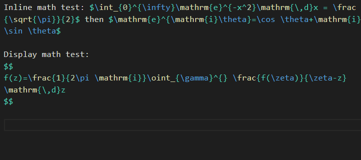
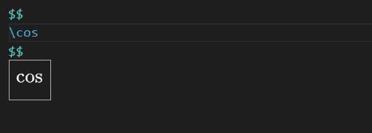

# Math Key for VS Code

An extension for math preview and Other functions.

## Usage

Install this extension, and then put your cursor into math block in *markdown(.md)* or *latex(.tex)* file. Then you will get real-time preview:

And when you input math formula, the preview will update:

Enjoy!

## Dependency

- Extension: **HyperScopes** (*draivin.hscopes*) 
    - to get scope of text.

